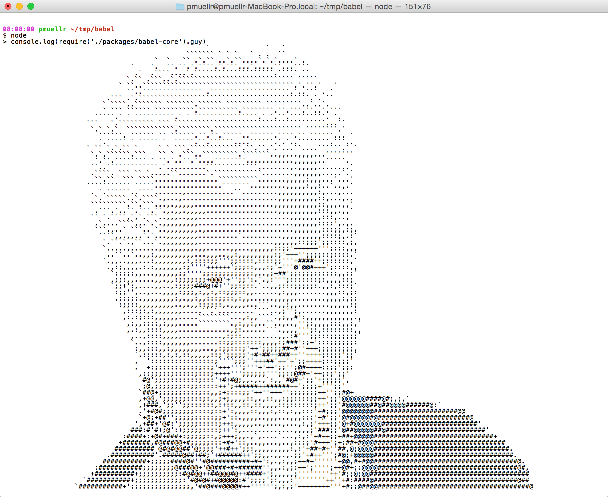

# Babel

From my point of view Babel easily can be used from NPM.
Therefore, it is necessary to first explain what NPM.
NPM is the default package manager on JavaScript runtime environment-a- NodeJS.
NodeJS in principle be used to develop backend web applications, but the big popularity acquired by ecosystem of tools developed around its package manager - NPM.

# scaffolding tools


Extremely popular as a so-called. scaffolding tools.
These are tools for rapid generation of skeleton of a typical application.
One of them is, for example yeoman:
  
[http://yeoman.io/](http://yeoman.io/)  

It supports very large inventory of generators, which you can see here:
 
[http://yeoman.io/generators/](http://yeoman.io/generators/) 
  
Besides generation of startup application, these generators support and useful tools for the further development of the application.
For example, as can be seen here:

https://github.com/yeoman/generator-angular#readme  

The for Generator AngularJS supports the generation of new controllers, directives, filters, views and so on.
Things go much further. Ever since the beginning of the project you already have organized the build process and
code minification.

An example of a little thing done with help of yeoman, you can see here:
[http://gonaumov.github.io/easterEggs/](http://gonaumov.github.io/easterEggs/) 
 
The code can be seen here: 
[https://github.com/gonaumov/easterEggs](https://github.com/gonaumov/easterEggs) 

The work took me about two hours. I escaped a lot of things - downloading libraries and the structure of the application - controllers, directives, service and so on.

# Trend of development in command line tools.
 
It tends more and more tools to become npm packages.
One example of this trend, for example jpm. Jpm is a command line tool supported by Mozilla, serves as the development,
testing and packaging of supplements browser Mozilla Firefox:

[https://developer.mozilla.org/en-US/Add-ons/SDK/Tools/jpm](https://developer.mozilla.org/en-US/Add-ons/SDK/Tools/jpm) 

jpm is the successor of cfx tool that was walking with older versions of Mozila FireFox add-on SDK.

# Dependencies in npm
Npm keep the list of dependencies in .json file called package.json. Here is an example of a typical package.json:
```
{ 
  "name": "babelpresentation", 
  "version": "1.0.0", 
  "description": "babel presentation", 
  "main": "index.js", 
  "scripts": { 
    "test": "echo \"Error: no test specified\" && exit 1" 
  }, 
  "author": "Georgi Naumov", 
  "license": "ISC", 
  "devDependencies": { 
    "babel-cli": "^6.11.4" 
  } 
} 
```

# Where are the modules in the file system?

npm modules are contained in the directory with name node_modules in the same project.
If this directory doesn't exists command npm install, will download the necessary modules and create the directory.


# The funny side of NPM.
These days, there was a funny event, when it turned out that there asci art in babel-core, but it is already removed. 
Let's examine what is in this PR:
[https://github.com/babel/babel/pull/3656](https://github.com/babel/babel/pull/3656)    


# Why we need Babel?

Babel is the de facto converter of EcmaScript EcmaScript 6 to 5 with whose help we can use EcmaScript 6 standard before it can be maintained at a certain environment.

# Syntax Transformers
Babel supports the current version of the EcmaScript - EcmaScript 2015 with the help of
syntax transformers. These are plugins that allow you to use the current syntax EcmaScript 2015 right now - without expecting support in browsers.
Babel provides us with this by babel-preset-es2015 plugin that combines several things.

# Arrows and Lexical This
Arrows are a function shorthand using the => syntax. They are syntactically similar to the related feature in C#, Java 8 and CoffeeScript. 
They support both expression and statement bodies. Unlike functions, arrows share the same lexical this as their surrounding code.

```javascript
var a = () => {};
var a = (b) => b;

const double = [1,2,3].map((num) => num * 2);
console.log(double); // [2,4,6]

var bob = {
  _name: "Bob",
  _friends: ["Sally", "Tom"],
  printFriends() {
    this._friends.forEach(f =>
      console.log(this._name + " knows " + f));
  }
};
console.log(bob.printFriends());
```
# Classes

ES2015 classes are a simple sugar over the prototype-based OO pattern. Having a single convenient declarative form makes class patterns easier to use, 
and encourages interoperability. Classes support prototype-based inheritance, super calls, instance and static methods and constructors.

```javascript
class SkinnedMesh extends THREE.Mesh {
  constructor(geometry, materials) {
    super(geometry, materials);

    this.idMatrix = SkinnedMesh.defaultMatrix();
    this.bones = [];
    this.boneMatrices = [];
    //...
  }
  update(camera) {
    //...
    super.update();
  }
  static defaultMatrix() {
    return new THREE.Matrix4();
  }
}
```

# Enhanced Object Literals
Object literals are extended to support setting the prototype at construction, shorthand for foo: foo assignments, 
defining methods and making super calls. Together, these also bring object literals and class declarations closer together, 
and let object-based design benefit from some of the same conveniences.

```javascript
var obj = {
    // Sets the prototype. "__proto__" or '__proto__' would also work.
    __proto__: theProtoObj,
    // Computed property name does not set prototype or trigger early error for
    // duplicate __proto__ properties.
    ['__proto__']: somethingElse,
    // Shorthand for ‘handler: handler’
    handler,
    // Methods
    toString() {
     // Super calls
     return "d " + super.toString();
    },
    // Computed (dynamic) property names
    [ "prop_" + (() => 42)() ]: 42
};
```

# Template Strings
Template strings provide syntactic sugar for constructing strings. This is similar to string interpolation features in Perl, 
Python and more. Optionally, a tag can be added to allow the string construction to be customized, avoiding injection attacks or 
constructing higher level data structures from string contents.
```javascript
// Basic literal string creation
`This is a pretty little template string.`

// Multiline strings
`In ES5 this is
 not legal.`

// Interpolate variable bindings
var name = "Bob", time = "today";
`Hello ${name}, how are you ${time}?`

// Unescaped template strings
String.raw`In ES5 "\n" is a line-feed.`

// Construct an HTTP request prefix is used to interpret the replacements and construction
GET`http://foo.org/bar?a=${a}&b=${b}
    Content-Type: application/json
    X-Credentials: ${credentials}
    { "foo": ${foo},
      "bar": ${bar}}`(myOnReadyStateChangeHandler);
```

# Destructing

Destructuring allows binding using pattern matching, with support for matching arrays and objects. Destructuring is fail-soft, 
similar to standard object lookup foo["bar"], producing undefined values when not found. 


# Example for destructing
```javascript
// list matching
var [a, ,b] = [1,2,3];
a === 1;
b === 3;

// object matching
var { op: a, lhs: { op: b }, rhs: c }
       = getASTNode()
```

# More examples for destructing
```javascript
// object matching shorthand
// binds `op`, `lhs` and `rhs` in scope
var {op, lhs, rhs} = getASTNode()

// Can be used in parameter position
function g({name: x}) {
  console.log(x);
}
g({name: 5})
```

# Even more examples for destructing
```javascript
// Fail-soft destructuring
var [a] = [];
a === undefined;

// Fail-soft destructuring with defaults
var [a = 1] = [];
a === 1;

// Destructuring + defaults arguments
function r({x, y, w = 10, h = 10}) {
  return x + y + w + h;
}
r({x:1, y:2}) === 23
```
# Default + Rest + Spread
Callee-evaluated default parameter values. Turn an array into consecutive arguments in a function call. 
Bind trailing parameters to an array. Rest replaces the need for arguments and addresses common cases more directly.
```javascript
function f(x, y=12) {
  // y is 12 if not passed (or passed as undefined)
  return x + y;
}
f(3) == 15
```
```javascript
function f(x, ...y) {
  // y is an Array
  return x * y.length;
}
f(3, "hello", true) == 6
```
```javascript
function f(x, y, z) {
  return x + y + z;
}
// Pass each elem of array as argument
f(...[1,2,3]) == 6
```
# Let + Const
Block-scoped binding constructs. let is the new var. const is single-assignment. 
Static restrictions prevent use before assignment.
```javascript
function foo(flag) {
    if (flag) {
        let a = 10;
    }
    return a;           // ReferenceError: a is not defined
}
console.log(foo(true));
```
# Iterators + For..Of
Iterator objects enable custom iteration like CLR IEnumerable or Java Iterable. Generalize for..in to custom iterator-based iteration with for..of. 
Don’t require realizing an array, enabling lazy design patterns like LINQ.
```javascript
let fibonacci = {
  [Symbol.iterator]() {
    let pre = 0, cur = 1;
    return {
      next() {
        [pre, cur] = [cur, pre + cur];
        return { done: false, value: cur }
      }
    }
  }
}

for (var n of fibonacci) {
  // truncate the sequence at 1000
  if (n > 1000)
    break;
  console.log(n);
}
```

# Generators
Generators simplify iterator-authoring using function* and yield. A function declared as function* returns a Generator instance. 
Generators are subtypes of iterators which include additional next and throw. These enable values to flow back into the generator, 
so yield is an expression form which returns a value (or throws).

# Simple example of generator functions. 
```javascript
function* idMaker(){
  var index = 0;
  while(index < 3)
    yield index++;
}

var gen = idMaker();

console.log(gen.next().value); // 0
console.log(gen.next().value); // 1
console.log(gen.next().value); // 2
console.log(gen.next().value); // undefined
// ...
```

# Modules
Language-level support for modules for component definition. Codifies patterns from popular JavaScript module loaders (AMD, CommonJS). 
Runtime behaviour defined by a host-defined default loader. Implicitly async model – no code executes until requested modules are available and processed.

```javascript
// lib/math.js
export function sum(x, y) {
  return x + y;
}
export var pi = 3.141593;

// app.js
import * as math from "lib/math";
console.log("2π = " + math.sum(math.pi, math.pi));

// otherApp.js
import {sum, pi} from "lib/math";
console.log("2π = " + sum(pi, pi));
```

# Map + Set + WeakMap + WeakSet
Efficient data structures for common algorithms. WeakMaps provides leak-free object-key’d side tables.
```javascript
// Sets
var s = new Set();
s.add("hello").add("goodbye").add("hello");
s.size === 2;
s.has("hello") === true;

// Maps
var m = new Map();
m.set("hello", 42);
m.set(s, 34);
m.get(s) == 34;

// Weak Maps
var wm = new WeakMap();
wm.set(s, { extra: 42 });
wm.size === undefined

// Weak Sets
var ws = new WeakSet();
ws.add({ data: 42 });
// Because the added object has no other references, it will not be held in the set
```
# How to install Babel from npm? 

```
 npm install --save-dev babel-core
```
# Usage

```
require("babel-core").transform("code", options);
```
If we want to use  babel-preset-es2015 we must install it.
```
npm install babel-preset-es2015 --save-dev
```

Much more convenient to use, however is gulp-babel. This is gulp plugin for babel.
[https://www.npmjs.com/package/gulp-babel](https://www.npmjs.com/package/gulp-babel)

# .babelrc
.babelrc file is the configuration file of babel. babel search for this file in the root of a project.
From .babelrc file you can allow the installed plugins and setvat number of options.

For example, if you have installed ecma2015 preset you must enable configuration file like that:
```
{
  "presets": ["es2015"]
}
```      
# gulp-babel

gulp-babel is cool gulp plugin. This is example of gulp-babel usage. 
```javascript
const gulp = require('gulp');
const babel = require('gulp-babel');
 
gulp.task('default', () => {
    return gulp.src('app.js')
        .pipe(babel({
            presets: ['es2015']
        }))
        .pipe(gulp.dest('dist'));
});
```

# Questions? 

Q & A 


  
